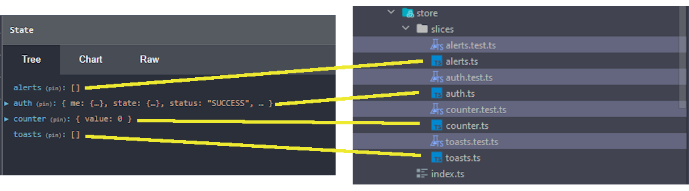

# Redux Overview

Following is a very high level overview of Redux, please see the more in-depth explanations and
tutorials at:

- [The Redux Homepage](https://redux.js.org/introduction/getting-started)
- [The Redux Toolkit Page][rdxtk]

## [Redux][rdx]

[Redux][rdx] is an opinionated implementation of Facebook's [Flux architecture pattern][flux].
With Redux, application state is kept in a single global store supplying all parts of said
application with a single source of truth to model. All updates application state are handled via a unidirectional
data flow: actions are dispatched to the Redux store where pure functions, known as reducers, handle producing a
new copy of the state tree with any instructed changes.

_*One-way Flow Example:*_


<cite>source: [Redux Toolkit][rdxtk]</cite>

### Advantage(s)

- The centralized store gives you a single source of truth for the entire application.
- Pure reducer functions ensure that you are never directly mutating state.
- Predictable state updates make it easier to understand the data flow.
- Browser tooling allows you to see the current applications state, and enables time travel
  back and forth through the state changes.

_*Example:*_


### Disadvantage(s)

Most of the complaints regarding Redux boil down to two issues:

1. An excessive amount of boilerplate code needed to create actions and reducers
2. The Store quickly becoming _bloated_ and hard to reason about. With multiple
   reducers scattered through the code base you can run into state key collisions

Fortunately the bulk of these concerns have been addressed by the subject of the next section

## [Redux Toolkit][rdxtk]

The [Redux Toolkit][rdxtk] takes most of the repetitive boilerplate out of creating
actions and reducers by abstracting everything into something called a `slice`.

Each slice resides in its own file and is merely a branch off of the global state
tree - one could almost think of the slice as something akin to a context as
demonstrated by this image:



### Creating

To illustrate the mechanics, let's walk through the creation of a
very basic slice and then using it in a component.

1. Define the slice

   file: _*/src/store/slices/counter.ts*_

   ```typescript
   import { createSlice } from '@reduxjs/toolkit';
   import { IStore } from '../index';

   // Defines the shape of this slice on the global
   //   store
   export interface ICounterSlice {
     value: number;
   }

   // when the root reducer (store) first initializes this
   //  will be the beginning state of this slice
   const initialState: ICounterSlice = {
     value: 0,
   };

   // NOTE: Exporting for access in tests only.
   //       The only appliction view into the slice should be
   //       through the slice's actions and/or selectors
   export const counter = createSlice({
     name: 'counter',
     initialState,
     reducers: {
       // a reducer listening for an action with a type of
       //  'counter/increment'
       increment: (state: ICounterSlice) => {
         // ?? I thought you said these had to be immutable?
         state.value += 1;
       },
       decrement: (state: ICounterSlice) => {
         // actually the redux toolkit uses the Immer library
         //  to abtract proper immutable updating, so this
         //  mutating statement
         state.value -= 1;
         // actually becomes something like the following
         // after compilation:
         //   state = { ...state, value: state.value -1 }

         // This becomes most useful when you have nested
         // values that need updating:
         //   state.foo.bar = 'new value';
         // is a bit easier to type than:
         //   state = {
         //     ...state,
         //     foo: {
         //       ...state.foo,
         //       bar: 'new value'
         //     }
         //   };
         // (whew) and that was only 2 levels deep
       },
     },
   });

   // actions, or more accurately action creator factories
   // actions are simply messages you dispatch to the redux
   // store signalling it to update state via matching reducer
   //
   // If you were to console.log `increment.type` it will
   // give you the type (or key) that the toolkit uses to
   // match the action to the reducer - in this case "counter/increment"
   // Invoking it should create something like:
   //   { type: 'counter/increment', payload: null }
   export const { increment, decrement } = counter.actions;

   export const selectCount = (state: IStore) => state.counter.value;

   // this is what the root reducer (store) uses to attach
   //  this slice to the global state object
   export default counter.reducer;
   ```

2. Attach it to the store

   file: _*/src/store/index.ts*_

   ```typescript
   import { configureStore } from '@reduxjs/toolkit';
   import counterReducer, { ICounterSlice } from './slices/counter';

   // describes the shape of the entire global state tree
   export interface IStore {
     counter: ICounterSlice;
   }

   // assembles all of the reducers from the slices into one
   //   single reducer pipeline
   export default configureStore({
     reducer: {
       counter: counterReducer,
     },
   });
   ```

   at this point the store would look like the following after initialization

   ```javascript
   {
     counter: {
       value: 0;
     }
   }
   ```

3. Leverage the store in a component

   file: _*/src/components/Counter/Counter.tsx*_

   ```typescript jsx
   import React from 'react';
   import { useAppSelector, useAppDispatch } from '../../helpers';
   import { decrement, increment, selectCount } from '../../store/slices/counter';

   export default function Counter() {
     // creates an observer that only triggers an
     //   update when the specific watched value changes
     // can also be defined ad-hoc like so:
     //   const count = useSelector((state: IStore) => state.counter.value);
     const count = useSelector(selectCount);
     const dispatch = useAppDispatch();

     return (
       <div>
         <button
           data-testid="add-button"
           aria-label="Increment value"
           onClick={() => dispatch(increment())}>
           +
         </button>
         <span data-testid="output-display">{count}</span>
         <button
           data-testid="subtract-button"
           aria-label="Decrement value"
           onClick={() => dispatch(decrement())}>
           -
         </button>
       </div>
     );
   }
   ```

   **TypeScript Note:** To avoid typing errors the below set of hooks is now recommended by
   the Redux Toolkit documentation:

   file: _*/src/helpers/hooks.ts*_

   ```typescript jsx
   /* istanbul ignore file */
   /*
    * There is no logic to test in this file as it is simply an implementation of
    * the pattern described in: https://redux.js.org/tutorial/typescript-quick-start
    * and is merely here to help TypeScript suss out typing around redux actions
    */
   import { TypedUseSelectorHook, useDispatch, useSelector } from 'react-redux';
   import { AppDispatch, IStore } from '../store';

   export const useAppDispatch: () => AppDispatch = useDispatch;
   export const useAppSelector: TypedUseSelectorHook<IStore> = useSelector;
   ```

[flux]: https://facebook.github.io/flux/ 'Flux architecture pattern'
[rdx]: https://redux.js.org/ 'Redux Homepage'
[rdxtk]: https://redux-toolkit.js.org/ 'Redux Toolkit'
